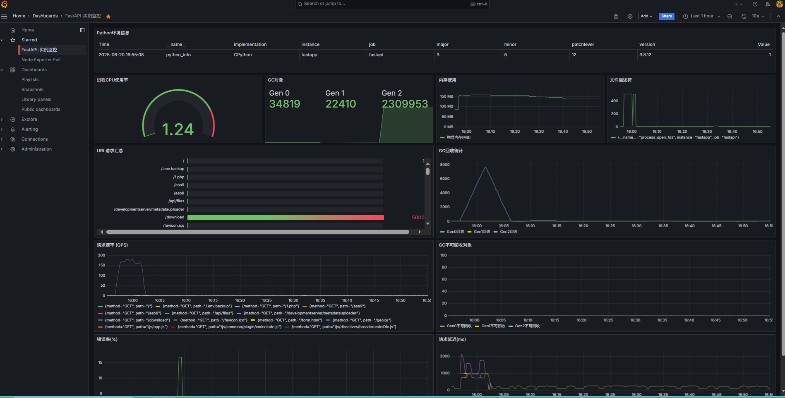

### fastapi 用例
编译打包： nuitka --onefile --standalone --disable-ccache --windows-icon-from-ico=web.ico main.py
        开启多worker后，编译需要手动添加模块： nuitka --onefile --standalone --include-module=file_updown --disable-ccache file_updown.py

依赖：pip install fastapi uvicorn aioredis httpx pydantic jinja2 python-multipart nuitka psutil websockets aiocache[redis] cachetools aiomysql dbutils prometheus-client starlette_exporter

### 新增Prometheus+Grafana运维监控
